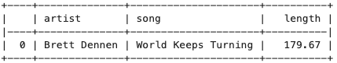
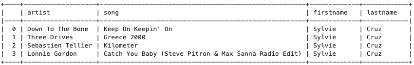
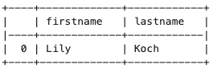

# User song play analysis with Cassandra

The purpose of this database is to analyse data collected on user event. In particular, we want to understand user activity and what are the most common songs users are listening. Datasets are in the csv form that can be found under `event_data/` directory. The overall process is to load preprocessed data `event_datafile_new.csv` into Cassandra table to answer given queries. 

## Sample Queries

1. `SELECT artist, title, song FROM session_event WHERE sessionId=172 and itemInSession=4`  

1. `SELECT artist, song, firstName, lastName FROM song_by_user_session WHERE userId=10 AND sessionId=182 SORT BY itemInSession`  

1. `SELECT firstName, lastName FROM user_by_song WHERE song='Come As You Are'`  
