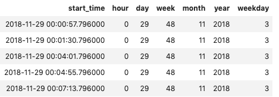

# Song play analysis with PostgreSQL

The purpose of this database is to analyse data collected on songs and user activity. In particular, we want to understand what songs users are listening to. Dataset is in JSON format abd can be retrieved from the [million song dataset](https://labrosa.ee.columbia.edu/millionsong/). The overall process is to extract data from logs into the relational query-ready PostgreSQL. 

## Summary
Sparkify's ETL project is to model song dataset in PostgreSQL using the star schema. Sample dataset can be found on `data/` directory. The cleaning process is done by first extracting columns for **songs** and **artists**s table from `song_data` follows by duplication check based on the table primary key. Then, based on the `log_data`, each song that is played next, we parse its timestamp into several temporal granularities such as hour, week, month, etc which will be stored in **time** table. Finally, we extract **users** and song play information and load them into their respective table.   

The table structure of **songplays** acts as the fact table with foreign keys to:
* start_time REFERENCES time (start_time)
* user_id REFERENCES users (user_id)
* song_id REFERENCES songs (song_id)
* artist_id REFERENCES artists (artist_id)

Attributes of each table can be found on `sql_queries.py`

## Example Tables

####  Songplays

#### Users

#### Artists

#### Songs

#### Time

## How to run:

1. Ensure PostgreSQL is running on localhost.
1. Run create_tables.py which will create a a database called <ins>sparkifydb</ins> and a user called <ins>student</ins> with password <ins>student</ins>. 

`python create_tables.py`
1. Run etl.py to insert data into tables. 
`python etl.py`
1. Check the tables by running example queries using `test.ipynb`.

